# 🌱 Nodi

**선생님이 올린 자료를 근거로, AI 답변을 개념 카드로 펼쳐 주는 교실용 학습 캔버스.**

[](https://opensource.org/licenses/MIT) [](https://www.typescriptlang.org/) [](https://nextjs.org/) [](https://react.dev/) [](https://www.python.org/) [](https://fastapi.tiangolo.com/) [](https://www.postgresql.org/) [](https://qdrant.tech/) [](https://www.docker.com/)

[English](README.md) | **한국어**

[](https://www.upstage.ai)

---

## 💭 Developer's Note

> <!-- TODO: 인용구 한 줄 -->

<!-- TODO: 개발 동기 -->

---

## ✨ Features

### 🗂️ 무한 캔버스 위의 개념 카드
- Upstage `solar-pro3`의 답변을 SSE로 받아, 정해진 카드 형식(`@concept: 제목 | 분류`)을 파싱해 캔버스에 카드로 그린다
- 분류(태그)마다 열 하나에 배치하고, 태그 하나가 `parent_item_id`로 이어진 대화 트리가 된다
- 화면 이동·펜·도형은 Excalidraw가 맡고, 카드는 그 위의 오버레이라 옮기기·수정·다시 질문하기가 된다
- 답하기 전에 도구 판단 단계가 11개 스킬(학급 자료 검색, 도판 검색, 강의 클립, 필기, 세션 파일 등) 중에서 고른다

### 🏫 학급 공간과 RAG
- 선생님이 참여 코드로 학급을 만들고 수업 자료·교과서(PDF, 이미지, TXT/MD)를 올린다
- 업로드는 Upstage Document Parse → 1,200자 청크(오버랩 150자) → `embedding-passage`(1024차원) → Qdrant 순서로 처리된다
- 질의는 `embedding-query`로 임베딩하고, 코사인 거리 0.60 안의 청크를 프롬프트에 넣는다
- Qdrant에는 id만 두고, 청크 본문은 호출자 권한으로 Postgres에서 다시 읽는다

### 🖼️ 교과서 도판과 강의 클립
- 교과서 페이지에서 도판을 잘라 내고, 페이지 본문을 문맥으로 비전 모델이 캡션을 만든다
- 답과 관련된 도판이나 강의 클립이 개념 카드 옆에 붙는다
- 관리자가 강의 패키지를 JSON으로 등록하고, 선생님이 학급마다 켠다

### ✍️ 손글씨 질문
- 펜으로 질문을 쓰면 획을 이미지로 그려 Gemini가 읽는다
- 카드 주변에 그린 화살표·동그라미·밑줄은 클라이언트에서 기하로 판정해, 답변이 "이거"가 어느 카드인지 안다

### 🔗 세션을 넘는 연결
- 홈 화면에 학생이 만든 카드로 개념 지도를 그린다
- 다른 세션의 카드와 거리가 정해진 구간(0.42~0.66) 안에 들면 짧은 설명이 달린 연결 배지를 띄운다
- 한 가지가 카드 세 장을 넘어 이어지면 질문 코치가 질문을 대신 써 주지 않고 탐구 방향만 알려 준다

### 🛠️ 선생님·관리자 콘솔
- 선생님은 학생별 학급 대화를 읽기 전용으로 보고, 자료와 강의 패키지를 관리한다
- 관리자는 사용량 개요, 프롬프트·스킬 기록이 담긴 턴 로그, RAG 테스트, 튜닝 설정, 백업, 권한 관리를 쓴다

### 🔐 계정과 권한
- 아이디 또는 이메일 + 비밀번호(bcrypt). 세션은 httpOnly 쿠키에 담긴 JWT
- 권한은 Postgres 행 수준 보안(RLS)이 강제한다(정책 71개, [`db/RLS_POLICIES.md`](db/RLS_POLICIES.md))

---

## 🚀 Getting Started

### Prerequisites
- [Docker](https://docs.docker.com/get-docker/)와 Docker Compose
- (선택) [Upstage API 키](https://console.upstage.ai/api-keys) — AI 답변, 검색, 파일 업로드
- (선택) [Gemini API 키](https://aistudio.google.com/apikey) — 손글씨 인식, 도판 캡션

### 실행
```bash
git clone https://github.com/Nodi-Laboratory/Nodi.git
cd Nodi
cp .env.example .env
docker compose up
```

[http://localhost:3000](http://localhost:3000)으로 접속한다. 첫 실행은 이미지 빌드로 몇 분 걸린다. 데모 데이터(학급, 교과서, 도판, 대화)는 처음 기동할 때 들어간다.

### 데모 계정
| 아이디 | 비밀번호 | 역할 |
|----------|----------|------|
| `demo` | `demo1234` | 학생 |
| `teacher` | `demo1234` | 선생님 |
| `admin` | `demo1234` | 관리자 |

### API 키 설정
키가 없어도 로그인과 데모 데이터로 모든 화면을 둘러볼 수 있다. 키가 필요한 기능만 안내 문구와 함께 비활성화된다.

- **`.env`에 넣기** — `UPSTAGE_API_KEY` / `GEMINI_API_KEY`(필요하면 `GEMINI_VISION_MODEL`도)를 채우고 다시 띄운다. 서버가 모든 사용자에게 이 키를 쓰고, 키 입력 UI는 나타나지 않는다.
- **앱 화면에서 입력** — 비워 두면 첫 진입 때 뜨는 팝업이나 **설정 → AI API 키**에서 입력한다. 키는 브라우저 localStorage에만 저장되고 요청마다 헤더로 전달되며, 서버는 저장하거나 로그에 남기지 않는다.
- 파일 업로드는 백그라운드 워커가 처리하므로 `.env`의 `UPSTAGE_API_KEY`가 있어야 동작한다.
- 고를 수 있는 Gemini 모델: `gemini-3.5-flash-lite`(기본), `gemini-3.1-flash-lite`, `gemini-3.5-flash`, `gemini-3.6-flash`.

---

## 🛠️ Tech Stack

| Category | Technology |
|----------|-----------|
| **Frontend** | Next.js 16 (App Router), React 19, TypeScript |
| **Canvas** | Excalidraw 0.18, D3.js 7 |
| **Styling** | Tailwind CSS 4 |
| **State** | TanStack Query 5, Zustand 5 |
| **Markdown / Math** | react-markdown, KaTeX |
| **Backend** | Python 3.12, FastAPI, asyncpg, APScheduler |
| **Database** | PostgreSQL 16 (행 수준 보안) |
| **Vector Search** | Qdrant (1024차원, 코사인) |
| **AI** | Upstage `solar-pro3`(대화·도구 호출), `embedding-query` / `embedding-passage`, Document Parse · Google Gemini(비전) |
| **Auth** | bcrypt, PyJWT (httpOnly 쿠키) |
| **Testing** | pytest, Vitest, Playwright |
| **Infra** | Docker Compose |

---

## 📁 Project Structure

```
Nodi/
├── 📂 frontend/
│   ├── 📂 src/
│   │   ├── 📂 app/                # 라우트: (auth) 로그인·가입, (app) 홈·세션·캔버스, teacher, admin
│   │   ├── 📂 components/
│   │   │   ├── 📂 canvas2/        # 캔버스, 카드, 도판, 클립, 펜 입력, 지도
│   │   │   ├── 📂 teacher/        # 선생님 콘솔
│   │   │   ├── 📂 admin/          # 관리자 콘솔 탭
│   │   │   └── 📂 settings/       # 설정·API 키 팝업
│   │   ├── 📂 lib/
│   │   │   ├── 📂 api/            # 백엔드 API 클라이언트
│   │   │   ├── 📂 canvas2/        # 배치 엔진, 스트림 파서, 펜 표시 기하
│   │   │   └── apiKeys.ts         # 브라우저 쪽 키 저장(localStorage)
│   │   └── proxy.ts               # 라우트 보호(세션 쿠키)
│   └── Dockerfile
├── 📂 backend/
│   ├── 📂 app/
│   │   ├── 📂 routers/            # /api 아래 REST + SSE 엔드포인트
│   │   ├── 📂 services/           # 채팅, RAG, Upstage, Gemini, Qdrant, 파일
│   │   │   └── 📂 worker/         # 백그라운드 인제스트 잡(파싱·임베딩·도판·강의)
│   │   ├── 📂 ai/                 # 도구 호출 오케스트레이터와 스킬
│   │   ├── 📂 auth/               # JWT 쿠키 인증, 역할 가드
│   │   ├── 📂 db/                 # 커넥션 풀, RLS 스코프 질의, 파일 저장
│   │   ├── 📂 seed_demo/          # 데모 데이터 + 미리 계산한 임베딩
│   │   └── main.py                # FastAPI 앱
│   ├── 📂 tests/
│   └── Dockerfile
├── 📂 db/
│   ├── 📂 migrations/             # 멱등 마이그레이션, 기동마다 적용
│   ├── 00_bootstrap.sql           # auth.uid(), users 테이블, DB 역할
│   ├── 01_schema.sql              # 테이블, RLS 정책, 함수
│   └── RLS_POLICIES.md            # 정책 목록
├── 📂 scripts/
│   └── 📂 capture-screenshots/    # Playwright 스크린샷 스크립트
├── 📂 image/                      # README 스크린샷
├── 📂 deploy/                     # 컨테이너를 쓰지 않는 운영 서버용 스크립트
├── 📂 docs/                       # 개발 가이드, 설계 기록
├── docker-compose.yml
└── .env.example
```

---

## 💡 How to Use

1. **로그인** — `demo` / `demo1234`로 들어가거나 학생·선생님으로 가입한다
2. **공간 고르기** — 세션 화면에서 개인 공간이나 코드로 참여한 학급을 고른다
3. **질문하기** — 답이 개념 카드로 캔버스에 써진다
4. **이어 묻기** — 카드를 골라 다시 묻거나 카드의 **다시 질문하기**를 누른다
5. **펜으로 묻기** — 펜으로 질문을 쓰고 카드에 화살표·동그라미를 그려 특정 카드에 대해 묻는다
6. **지도 보기** — 지금 대화의 태그별 트리를 본다
7. **선생님으로** — 자료·교과서를 올리고, 강의 패키지를 켜고, 학생의 학급 대화를 읽는다

---

## 👥 Team

| 이름 | 역할 |
|------|------|
| <!-- TODO: 팀원 --> | <!-- TODO: 역할 --> |

---

## 🎨 Screenshots

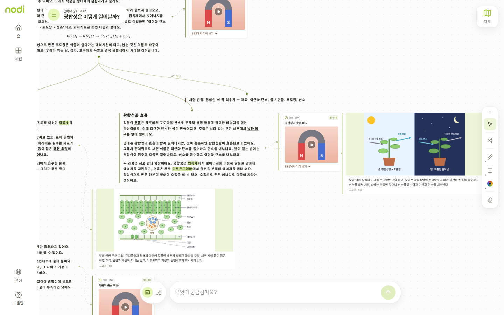

| | |
|---|---|
| 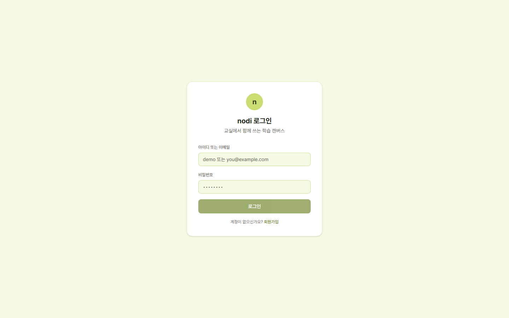<br>*로그인* | 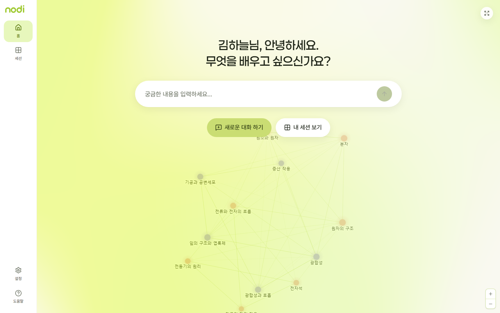<br>*홈 — 개념 지도* |
| 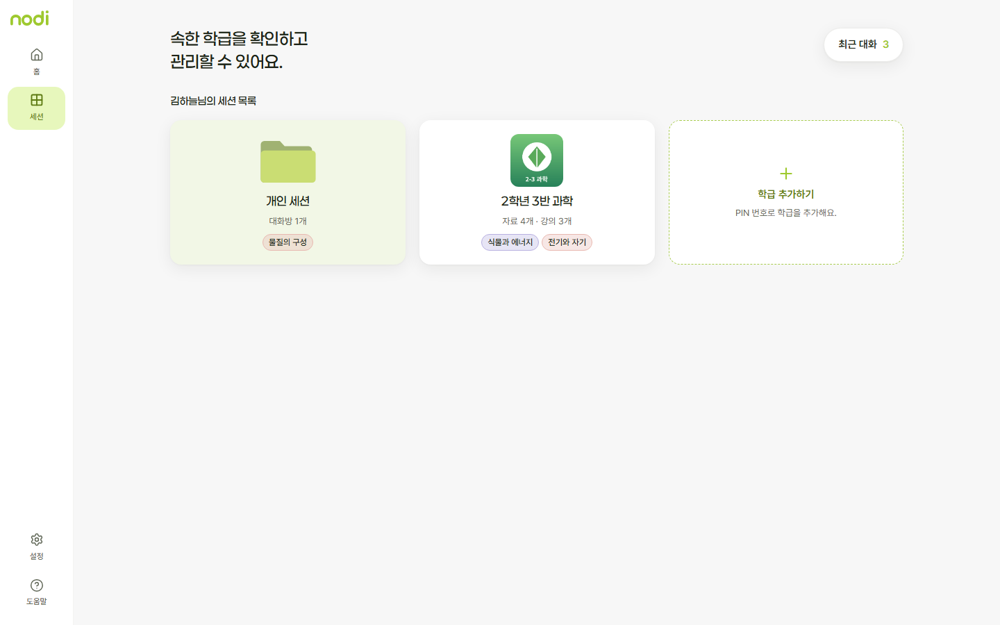<br>*개인 공간과 학급 공간* | 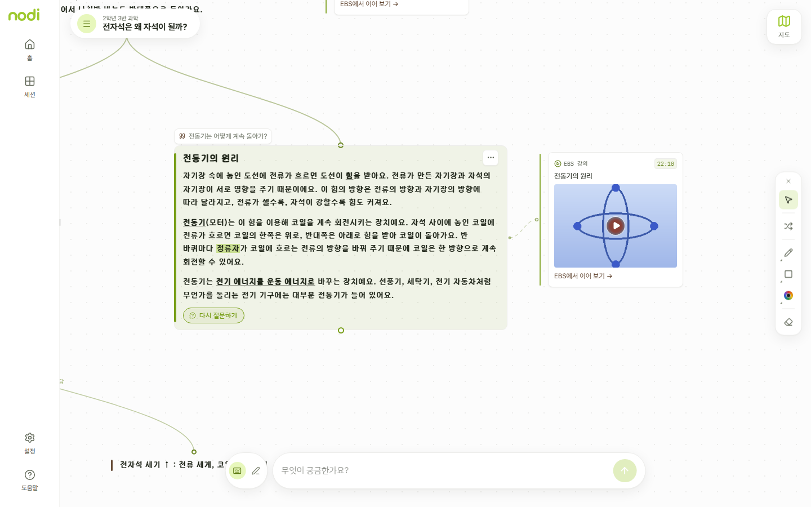<br>*강의 클립이 붙은 개념 카드* |
| 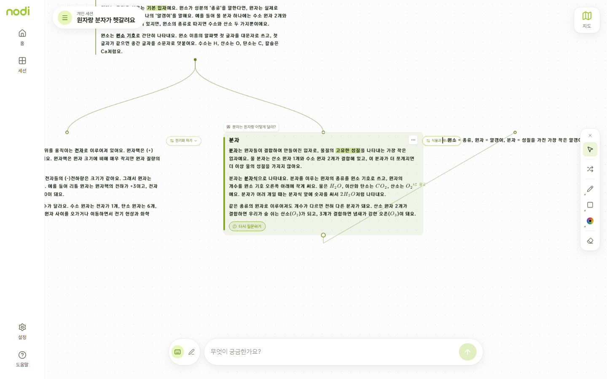<br>*다른 세션으로의 연결 배지* | 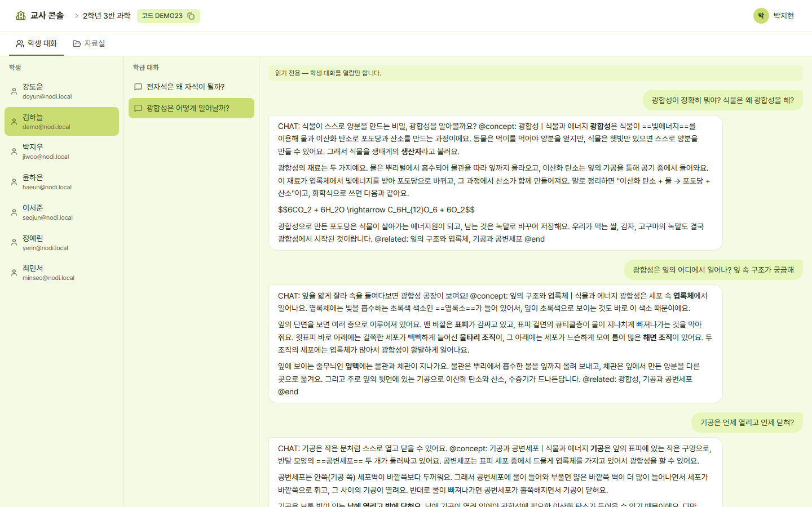<br>*선생님 — 학생 대화(읽기 전용)* |
| 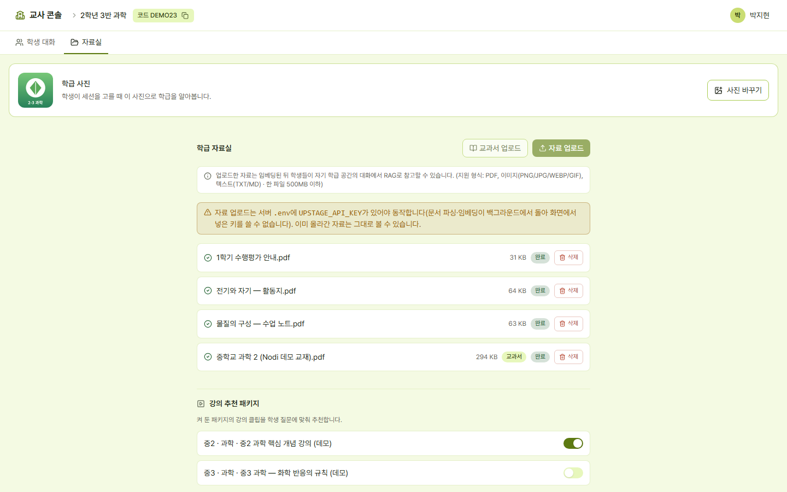<br>*선생님 — 자료실과 강의 패키지* | 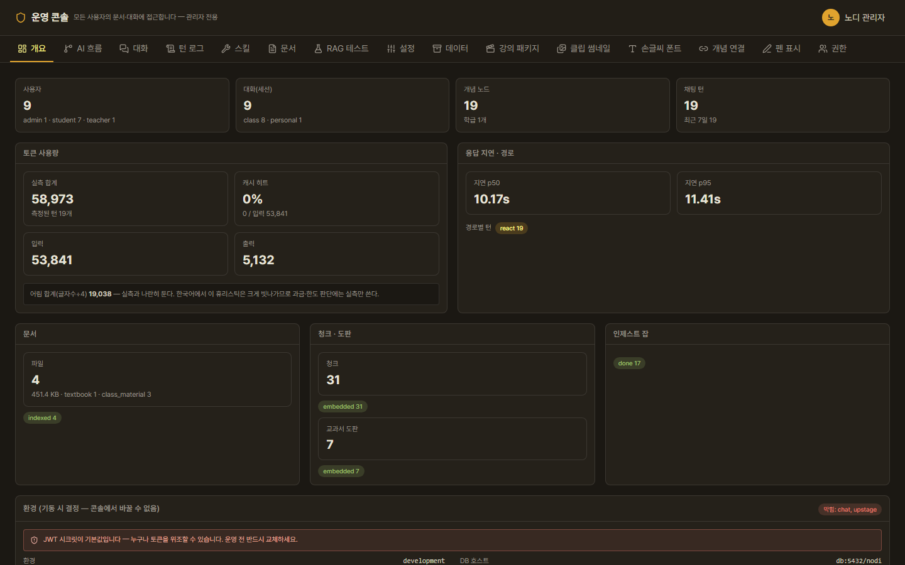<br>*관리자 콘솔* |
| 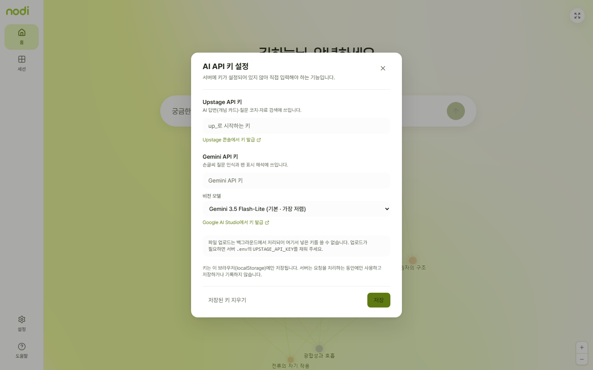<br>*API 키 설정* | 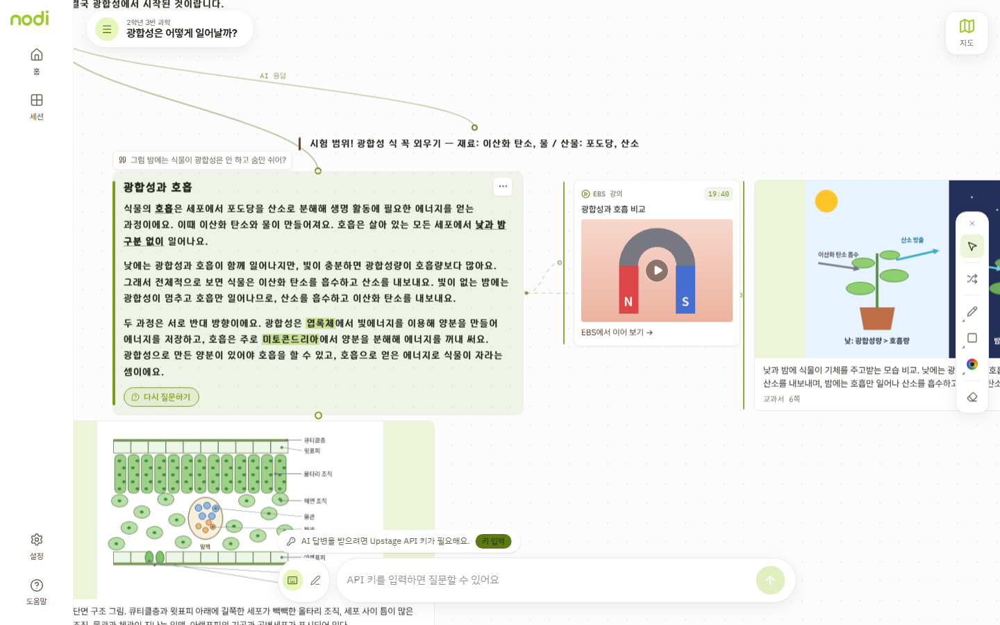<br>*키가 없으면 AI 입력만 비활성화* |

---

## 📝 License

MIT License. 자세한 내용은 [LICENSE](LICENSE)를 참고한다.

| 👤 Developer | ✉️ Email |
|------|-------|
| Zanviq | [zanviq.dev@gmail.com](mailto:zanviq.dev@gmail.com) |
